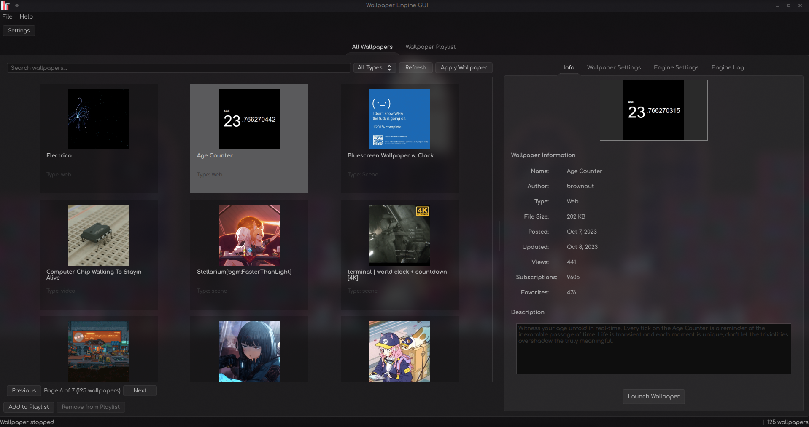
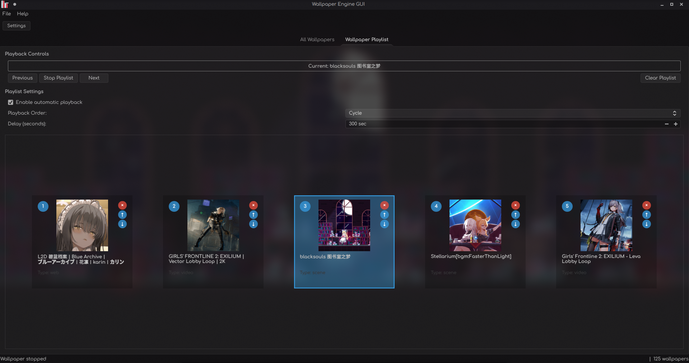
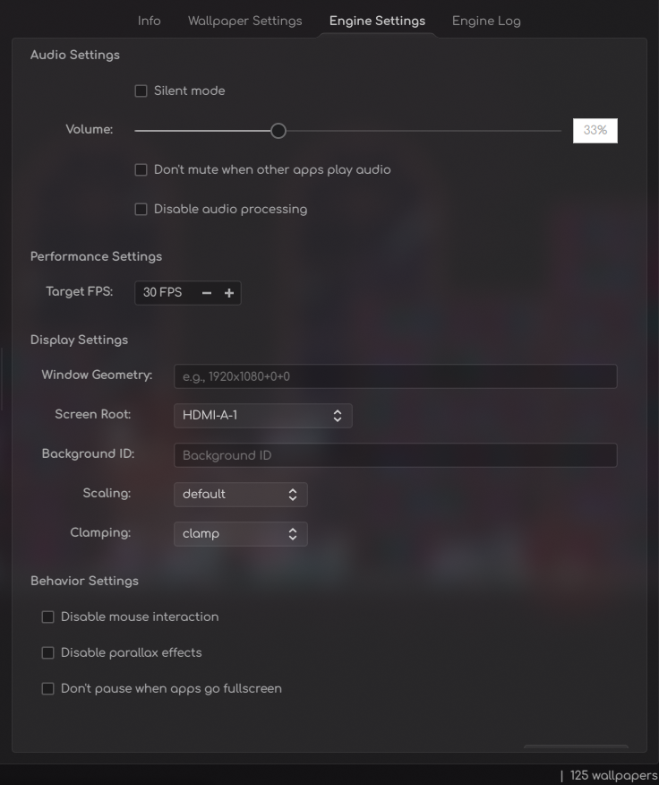
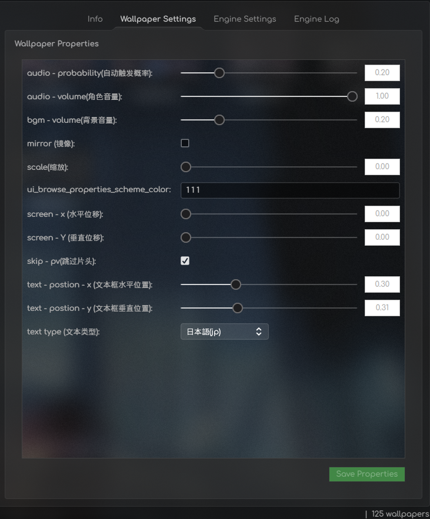

# WallpaperEngine GUI

GUI for the [Almamu/linux-wallpaperengine](https://github.com/Almamu/linux-wallpaperengine).
- Mostly automated first setup.
- Can get information about wallpaper based on workshop id using Steam API and store it. [You need to get API key for that](https://steamcommunity.com/dev/apikey) any domain name will do.
- Support QT Themes for KDE users.
- Somewhat usable in terms of design (but now even better).
- Restore previous state on restart.
- Has playlist support
- Has support for changing wallpaper properties that are specified in project.json with the ability to save them between launches and roll back to the default state
- Has support for individual settings (settings specific to linux-wallpaperengine) for running wallpapers
- Has support for working in the system tray

If you're using Fedora and KDE+Wayland (like me), you may have problems initializing GLEW for web wallpapers etc. I'll try to fix and test what's going on and report back. The app will report it as code 5. (there was a false alarm which I fixed but you need to check the engine log for any suspicious events.)
You can manually check the linux-wallpaperengine call with the formatted string used by the app in the Engine Log tab of your terminal to see if it's a GUI or binary issue.

## Screenshots








## Prerequisites

[Almamu/linux-wallpaperengine](https://github.com/Almamu/linux-wallpaperengine)
You need binary (~/build/output/linux-wallpaperengine) compiled and placed anywhere you want (After compilation, you can delete the local repository if you want, just remember to keep the binary.). Go to link above for the instructions. **And make sure you are using the correct DE and composer and installed all dependencies from his instruction pls tm.**

### Fedora / RHEL / CentOS
```bash
# Install development tools
sudo dnf groupinstall "Development Tools"
sudo dnf install cmake gcc-c++

# Install Qt6 dependencies
sudo dnf install qt6-qtbase-devel qt6-qtwebengine-devel qt6-qtmultimedia-devel
```

### Ubuntu / Debian
```bash
# Install development tools
sudo apt install build-essential cmake

# Install Qt6 dependencies
sudo apt install qt6-base-dev qt6-webengine-dev qt6-multimedia-dev
```

### Arch Linux
```bash
# Install development tools
sudo pacman -S base-devel cmake

# Install Qt6 dependencies
sudo pacman -S qt6-base qt6-webengine qt6-multimedia
```

#### Build Steps
```bash
git clone https://github.com/yourusername/wallpaperengine-gui.git
cd wallpaperengine-gui
mkdir build && cd build
cmake ..
make -j$(nproc)
sudo make install
```

## Usage

### First Launch
1. Run `wallpaperengine-gui`
2. Configure path in Settings if not auto-detected
3. Browse and select wallpapers from your collection
4. Enjoy

### Keyboard Shortcuts
- `F5` - Refresh wallpaper collection
- `Ctrl+,` - Open Settings
- `Ctrl+Q` - Quit application

## Configuration

Configuration files are stored in `/home/<user>/.config/wallpaperengine-gui/`:
- `config.ini` - Main application settings
- `wallpapers.cache` - Wallpaper metadata cache

## Dependencies

### Runtime Dependencies
- Qt6 Base (Core, Widgets, GUI)
- Qt6 Concurrent
- Qt6 Network
- Steam
- Copy of Wallpaper Engine installed
- Wallpapers downloaded from workshop
- Compiled [linux-wallpaperengine](https://github.com/Almamu/linux-wallpaperengine)

## Contributing

Contributions are welcome.

## License

This project is licensed under the MIT License - see the [LICENSE](LICENSE) file for details. 
**TL:DR Do what you want.**

## Acknowledgments

- Big fat W for this guy [Almamu/linux-wallpaperengine](https://github.com/Almamu/linux-wallpaperengine)
- Inspired by the original Wallpaper Engine for Windows

## Troubleshooting

### Common Build Issues

#### Qt6 Not Found
```bash
# Ensure Qt6 is installed and CMake can find it
export Qt6_DIR=/usr/lib64/cmake/Qt6
# or
export CMAKE_PREFIX_PATH=/usr/lib64/cmake/Qt6
```

#### Missing Dependencies
```bash
# Check for missing development packages
sudo dnf install qt6-qtbase-private-devel qt6-qtwebengine-private-devel
```

### Runtime Issues

#### Application Won't Start
```bash
# Check dependencies
ldd build/wallpaperengine-gui

# Run with debug output
QT_LOGGING_RULES="*=true" ./wallpaperengine-gui

# Run with --debug flag from terminal
./wallpaperengine-gui --debug
wallpaperengine-gui --debug
```

### Code Structure
```
src/
├── main.cpp              # Application entry point
├── MainWindow.*          # Main application window
├── WallpaperManager.*    # Wallpaper management logic
├── WallpaperPreview.*    # Wallpaper preview widget
├── SteamDetector.*       # Steam integration
├── ConfigManager.*       # Configuration management
├── SettingsDialog.*      # Settings interface
├── PropertiesPanel.*     # Wallpaper properties
└── SteamApiManager.*     # Steam API integration
```

### Adding Features
1. Create & Add
2. Add files to `CMakeLists.txt` SOURCES/HEADERS lists if needed
3. Build & Test

### Contributing
1. Fork the repository
2. Create a feature branch
3. Make changes and test thoroughly
4. Update documentation if needed
5. Submit a pull request

### TODO

1. Kill this
2. Make GUI better
3. Clean the code
4. ?
